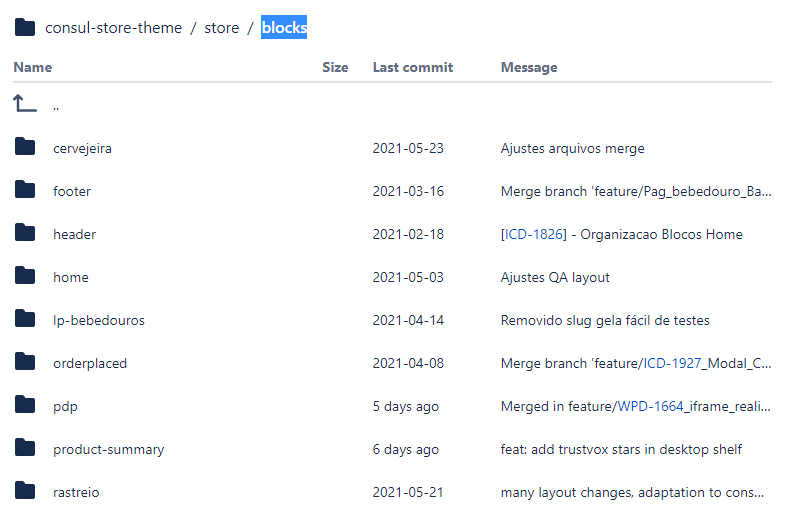
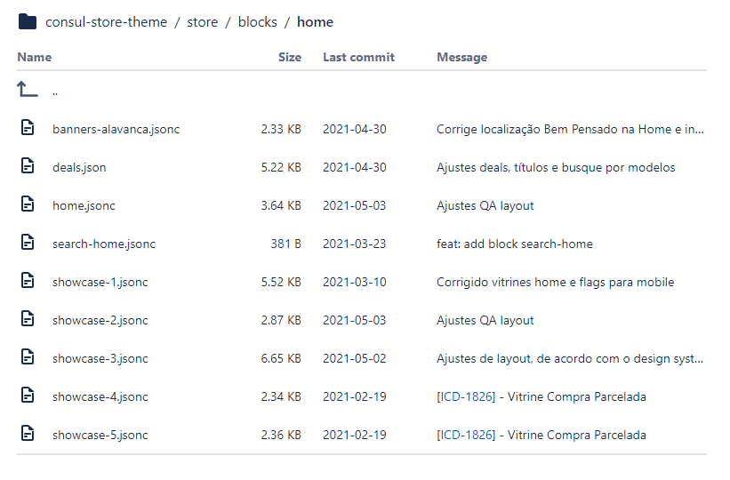
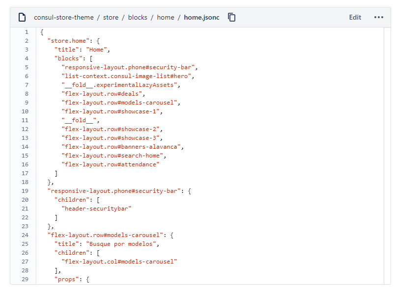
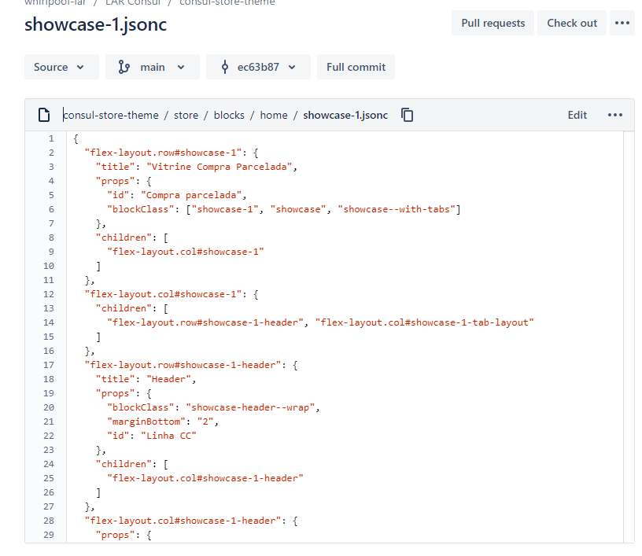
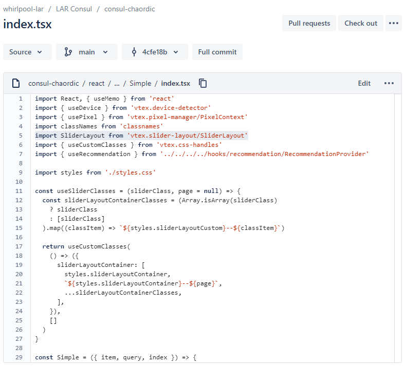
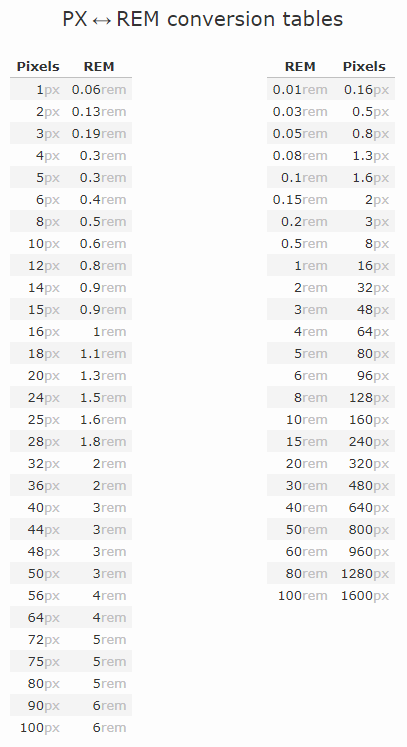

# Guia do Desenvolvimento

Esse é o resumo de desenvolvimento que a WHP usa nos seus apps de VtexIO, então
é importante seguir esse padrão, já que os devs da WHP vão mande-lo.

## Workspaces dos Devs

- dev1 => Erick Ieto
- dev2 => Vitor Ferraz
- dev3 => Rômulo Milani
- dev4 => Leonardo Xavier
- dev5 => Isabela Mazeto
- dev6 => Rafael Cruz
- dev7 => Alexandre Pereira
- dev8 => Igor Silva

## Layouts

#### Primeira versão

https://xd.adobe.com/view/1f798551-63f5-48b2-b435-72b6b92a40c3-4a2a/

#### Segunda versão

https://xd.adobe.com/view/043c9035-8cb4-4ff0-9274-af79d962ee6e-516f/

## Instalado e configurado nos apps

- SASS
- Husky
- Eslint
- Prettier
- Commit MSG Linter
- Styled Component

## VTEXIO DOCS

https://vtex.io/docs/recipes/development/vtex-io-cli-install/

https://learn.vtex.com/

https://developers.vtex.com/vtex-developer-docs/docs/welcome

https://github.com/vtex-apps

https://storetheme.vtex.com/

https://github.com/vtex-apps/store-theme

## Apps iniciais

#### store

Responsável por gerenciar as rotas da loja e posicionamento dos componentes (apps)

#### shared

Responsável por gerenciar todos os arquivos de configuração, métodos, classes, helpers e componentes customizados gerais da loja, para assim ser usados nos blocos das lojas.

#### design-system

Responsável por gerenciar todo o sistema de designer da loja, Buttons, cards, tabs, grid, inputs, modal etc, para assim ser usados nos componentes estendidos (apps), que podem herdar esse sistema de designer em um lugar centralizado.

#### services

Responsável por gerenciar o Backend da loja e Resolvers Graphql da loja.

[Veja Mais](/docs/PROJECT-ORGANIZATION.md)

#### Formulário para pedir novos apps

https://docs.google.com/forms/d/e/1FAIpQLSfhuhFxvezMhPEoFlN9yFEkUifGQlGP4HmJQgx6GP32WZchBw/viewform

## Componentes nativos em Blocos separadas

Para evitar uma maior quantidade de conflitos no arquivo **home.jsonc**, **product.jsonc** e etc, o ideal eh usar arquivos de blocos separados.

#### Exemplo do projeto de Consul

Cada pagina da loja foi separada em pasta.



Cada componente da Home por exemplo foram separadas em arquivos **.jsonc**.



Aqui esta o arquivo principal da Home(home.jsonc)



Aqui esta o um componente de vitrine usado na home (showcase-1.jsonc)



**Obs:** Sempre adicione a propriedade **title** no seu bloco de componente, para que seu componente seja fácil de ser encontrado no site editor.

## Adicionando um componente nativo dentro de um componente customizado.

É possível na Vtex adicionar um componente nativo dentro de um componente customizado.



https://github.com/corebiz-global/corebiz-chaordic-io/blob/master/react/components/Recommendation/templates/Simple/index.tsx

## GIT

#### Não usar o Git Flow dessa vez

**Obs:** Nesse projeto não usaremos o **Git Flow**, pois ele por padrão, remove as branchs, depois o comando finish. Precisamos que essas branchs, continuem no repositório para merga-las direto na **master**, após a validação da tarefa.

#### Iniciando uma nova branch

Quando se inicia uma nova tarefa, será preciso criar sempre uma nova branch nomeada com o tipo da tarefa, número da tarefa de descrição da tarefa.

[Veja Mais](/docs/COMMIT-RULES.md)

#### Mensagem de commit

Para melhor organizar os commits no repositório, será preciso seguir um padrão de escrita nas mensagens de commit.

[Veja Mais](/docs/COMMIT-RULES.md)

#### Pull Request

Após terminar o desenvolvimento das tarefas será necessário fazer um Pull Request para que outros devs possam validar e ajudar na melhoria do código. O ideal é que essa validação seja feita por 2 devs no mínimo.

[Veja Mais](/docs/TEMPLATE-DE-PR.md)

## Deploy

#### Homolog

Cada dev que terminar sua tarefa após validado o Pull Request, deverá fazer o merge
da sua tarefa na branch homolog, fazer o push e fazer o deploy no ambiente de homologação do vtexIO, para que sua tarefa seja testada pela equipe de QA.

[Veja Mais](../README.md#user-content-deploy)

#### Master

Sera necessário fazer o deploy na produção das tarefas que foram validadas pela equipe de QA.
O ideal é que isso seja feito 1 vez por semana, por apenas 1 pessoa.

[Veja Mais](../README.md#user-content-deploy)

## CSS

#### SASS

No **App de store** existe a possibilidade de usar o compilador SASS para agilizar o desenvolvimento do CSS.

Para executar:

```sh
yarn sass
```

Os arquivos dos estão dentro de **./styles/scss** e serão compilados dentro de **./styles/css**.

#### Styled Componentes

Nos apps de **shared** e **design-system** é possível usar styled component, caso o dev precise.

#### Tachyons

A vtex orienta sem a usar a lib de css **Tachyons**, para montar a estrutura do componente,
para a padronização entre componentes nativos e customizados.

https://tachyons.io/

https://vtex.github.io/vtex-tachyons/

#### CSS Handles

Dentro dos componentes customizados a vtex orienta como uma boa pratica usar o **CSS Handles**.

https://vtex.io/docs/app/vtex.css-handles@1.0.0/

https://developers.vtex.com/vtex-developer-docs/docs/
vtex-io-documentation-using-css-handles-for-store-customization

https://developers.vtex.com/vtex-developer-docs/docs/vtex-io-documentation-contributing-with-new-css-handles

## Configs - Definindo estilos iniciais

No VtexIO é possível definir configurações iniciais da loja, cores, fontes, paddings, margin e etc, afim de definir um padrão e identidade visual.

https://developers.vtex.com/vtex-developer-docs/docs/vtex-io-documentation-5-defining-styles

https://learn.vtex.com/docs/course-styles-course-step02styles-lang-pt

#### Tamanho de fontes

Por padrão a Vtex usa tamanho de fontes, espaçamento, margin na unidade **REM** ao invés de **PX**, então
é importante usar o padrão **REM**

**Tabela de conversão**

https://nekocalc.com/px-to-rem-converter


