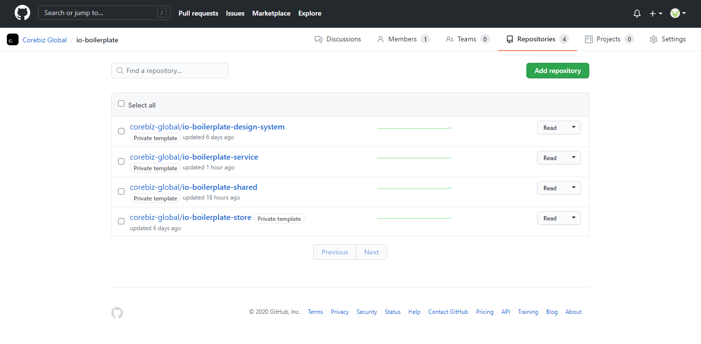

# New Repository

## Create new Repositories

Create a new repo called **storename.store** and use repository template **io-boilerplate-store**

Create a new repo called **storename.design-system** and use repository template **io-boilerplate-design-system**

Create a new repo called **storename.shared** and use repository template **io-boilerplate-shared**

Create a new repo called **storename.service** and use repository template **io-boilerplate-service**

## Add the repositories in Team

## Observations

You must ask for permission to use the store name.design-system, storename.shared, storename.service apps for vtex.

https://docs.google.com/forms/d/e/1FAIpQLSfhuhFxvezMhPEoFlN9yFEkUifGQlGP4HmJQgx6GP32WZchBw/viewform

