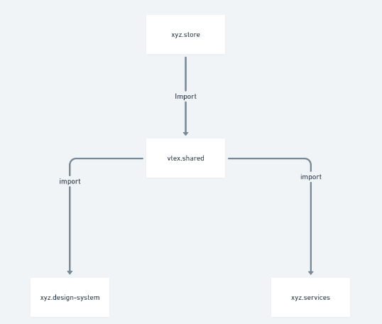

# Project organization

Store name exemple: xyz

## xyz.store

Responsible for managing store routes and component placement (apps)

## xyz.design-system

Responsible for managing the entire designer system of the store, Buttons, cards, tabs, grid, inputs etc, to be used in extended components (apps), which can inherit this designer system in a centralized place

## xyz.shared

Responsible for managing all files of customizable components, configuration, methods, classes, general store helpers, to be used in extended components (apps), which can inherit this designer system in a centralized place

## xyz.services

Responsible for managing all Graphql Resolvers.

## Observation

Replace the name "xyz" with the name of "your store"

